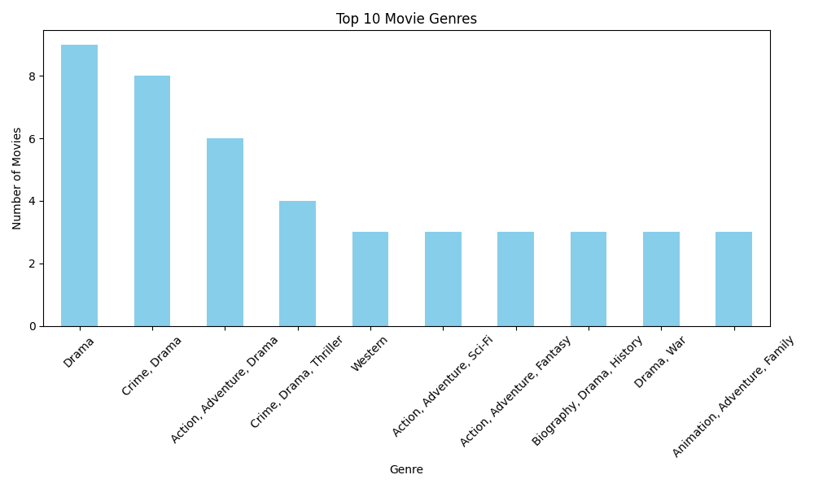

# IMDb Data Cleaning & Visualization

## Overview
This is a portfolio project demonstrating data cleaning and basic visualization skills using Python and pandas.  
The project uses a messy IMDb dataset to clean and organize movie information, then visualizes insights such as the most common movie genres.

---

## Dataset
The messy dataset used in this project is from Kaggle:  
[Messy IMDb Dataset](https://www.kaggle.com/datasets/davidfuenteherraiz/messy-imdb-dataset)

- Original dataset contains inconsistent column names, missing values, and duplicate entries.

---

The cleaning process includes:

1. Renaming messy columns for clarity
2. Dropping unnecessary or empty columns
3. Converting numeric columns (`Release_Year`, `Votes`) to proper types
4. Handling missing values for `Genre` and `Original_Title`
5. Removing duplicate rows
6. Saving the cleaned dataset as `imdb_cleaned.csv`

---

## Visualization

A simple bar chart shows the **top 10 movie genres**:

- Created using `matplotlib`
- Helps to quickly understand the distribution of movies across genres

---
